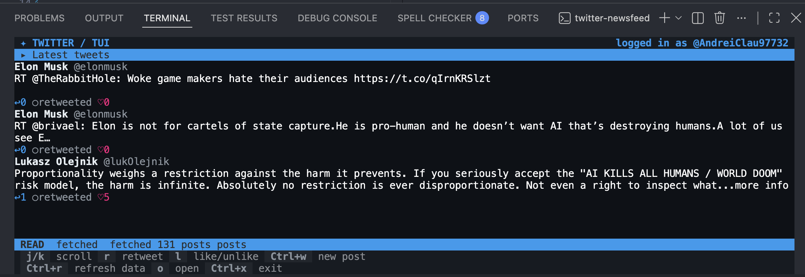
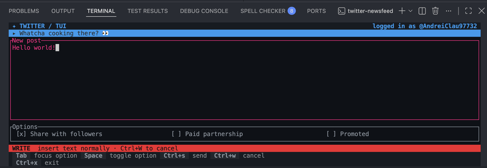

# Twitter Newsfeeder

A Rust terminal app for reading and posting on X (Twitter), built with Ratatui.

## Features

- **Browse your home timeline:** read posts from today and yesterday (UTC), with reposts excluded and API pagination handled automatically.
- **See post details:** view author names, handles, timestamps, and reply, repost, and like counts.
- **Interact with posts:** like or unlike posts, repost them, and open them in your default browser.
- **Compose posts:** switch to write mode, enter text, and publish from the terminal. The composer includes “Share with followers,” “Paid partnership,” and “Promoted” options.
- **Refresh on demand:** reload the timeline and liked-post state with a keyboard shortcut.
- **Sign in through OAuth 2.0:** authenticate in your browser using PKCE and a local callback listener.
- **Use keyboard controls:** navigate between posts and modes, with action feedback in the status bar.

## Terminal interface






## Setup

You need Rust and Cargo with support for the Rust 2024 edition, an interactive terminal, a browser, and an X developer application with OAuth 2.0 credentials and access to the API endpoints used by this app.

### Configure `.env`

From the project root, copy the example configuration if you do not already have a `.env` file:

```sh
cp .env.example .env
```

Fill in your application's OAuth 2.0 client ID and client secret:

```dotenv
TWITTER_CONSUMER_CLIENT_ID="your_oauth2_client_id"
TWITTER_CONSUMER_SECRET="your_oauth2_client_secret"
TWITTER_AUTHORIZE_URL="https://x.com/i/oauth2/authorize"
TWITTER_REDIRECT_URL="http://127.0.0.1:8080/callback"
TWITTER_REDIRECT_URL_PORT="8080"
TWITTER_TOKEN_URL="https://api.x.com/2/oauth2/token"
MAX_WAIT_TIME=30
```

| Variable | Purpose |
| --- | --- |
| `TWITTER_CONSUMER_CLIENT_ID` | Your application's OAuth 2.0 client ID. |
| `TWITTER_CONSUMER_SECRET` | Your application's OAuth 2.0 client secret. |
| `TWITTER_AUTHORIZE_URL` | Authorization endpoint used to build the sign-in link. |
| `TWITTER_REDIRECT_URL` | Callback URL; register this exact value in your X application's OAuth settings. |
| `TWITTER_REDIRECT_URL_PORT` | Port for the listener on `127.0.0.1`; must match the redirect URL's port. |
| `TWITTER_TOKEN_URL` | Endpoint used to exchange the authorization code for an access token. |
| `MAX_WAIT_TIME` | Number of seconds to wait for browser sign-in to complete. Increase this if 30 seconds is too short. |

All seven variables are required by the current implementation. Keep the callback path as `/callback`. If you change the port, update both environment values and the registered callback URL. Despite the variable names, use OAuth 2.0 credentials, not OAuth 1.0a API keys.

The app requests these scopes during sign-in: `tweet.read`, `tweet.write`, `users.read`, `like.read`, `like.write`, and `follows.read`.

Keep your credentials in `.env`, which is ignored by Git. The application loads this file at startup; `.env.example` contains only placeholders.

### Run

```sh
cargo run --release
```

Open the authentication link printed in the terminal and authorize the app before `MAX_WAIT_TIME` expires. After the browser redirects to the local callback, the terminal interface opens in read mode.

Sign-in is required each time you launch the app; access tokens are not saved between runs.

## Keyboard controls

| Mode | Key | Action |
| --- | --- | --- |
| Both | `Ctrl+w` | Switch between read and write modes. |
| Both | `Ctrl+r` | Refresh timeline data. |
| Both | `Ctrl+x` | Quit. |
| Read | `j` / `k` | Select the next / previous post. |
| Read | `l` | Like or unlike the selected post. |
| Read | `r` | Repost the selected post. |
| Read | `o` | Open the selected post in your browser. |
| Write | `Tab` | Cycle focus between the text input and posting options. |
| Write | `Space` | Toggle the focused posting option. |
| Write | `Ctrl+s` | Publish the post. |

The composer defaults to sharing with followers, with paid partnership and promoted options disabled. Publishing successfully returns you to read mode; use `Ctrl+r` to reload the feed.

## Development

```sh
cargo build
cargo test
```

The test suite includes mocked API requests, local OAuth callback tests, state and keyboard handling tests, and Ratatui rendering snapshots.

## License

Copyright (c) Andrei Tache <takeandrei5@gmail.com>.

Licensed under the [MIT license](LICENSE).
